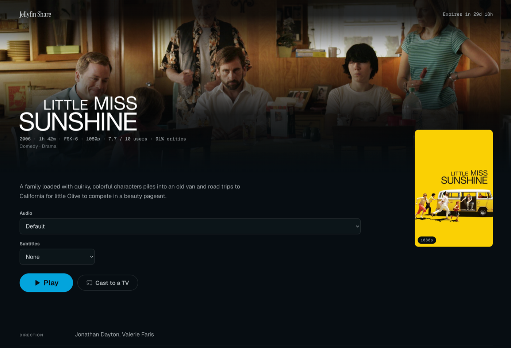
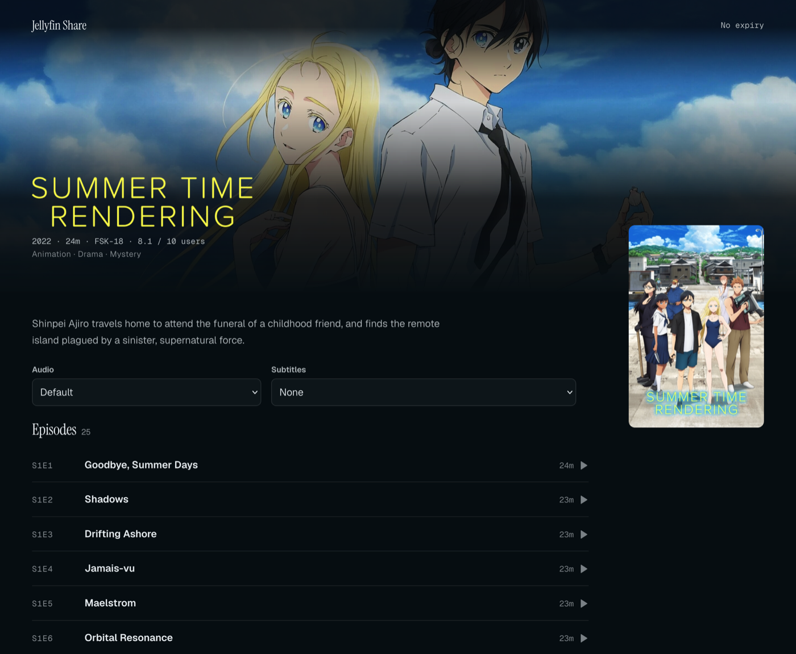
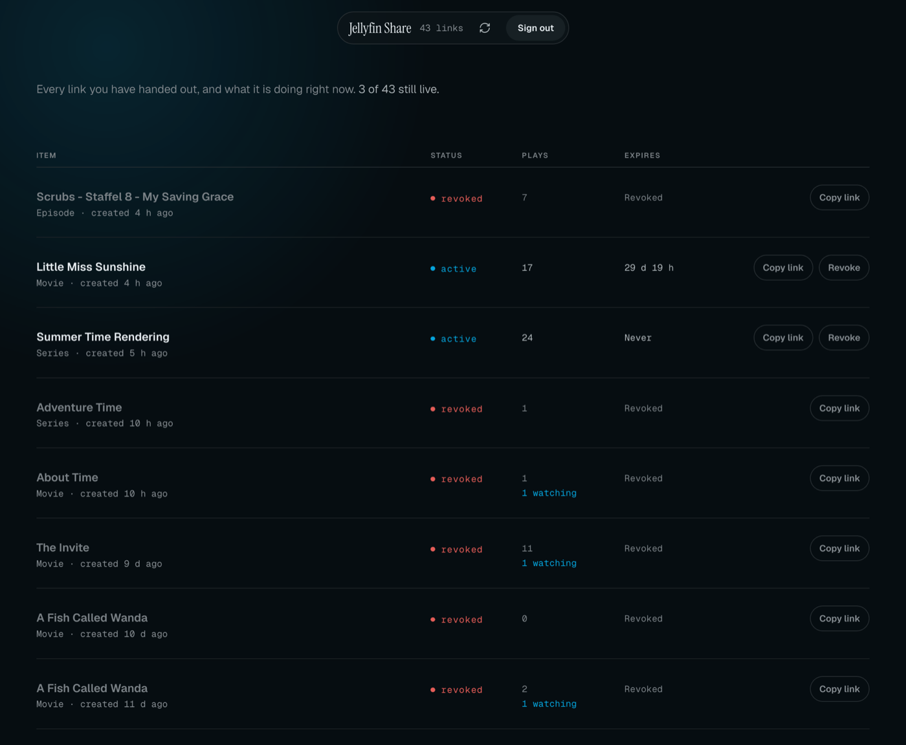

# Jellyfin Share

A secure, self-hosted solution for creating temporary, shareable links to your Jellyfin media content. Share movies and TV episodes with friends and family without giving them access to your Jellyfin server.

This is a fork of [monxas/jellyfin-share-backend](https://github.com/monxas/jellyfin-share-backend)
with Jellyfin 12 support, two security fixes and a reworked streaming path — see
[What this fork changes](#what-this-fork-changes).

## What it looks like

A shared film. The page leads with the artwork Jellyfin already holds, states the
link's terms in words rather than badges, and lets the viewer pick audio and
subtitle tracks before anything starts playing.



A shared series lists its episodes, each one startable on its own — or sent to a
television once a receiver is connected.



The admin surface is one scannable index of every link handed out: what it points
at, whether it is still live, how often it has been played, and when it expires.



## Features

- **Temporary Share Links** - Create time-limited links that automatically expire
- **Password Protection** - Optionally protect shares with a password
- **Play Limits** - Set maximum total plays and concurrent viewer limits
- **No Account Required** - Recipients don't need a Jellyfin account
- **Secure Streaming** - Media is proxied through the backend; Jellyfin is never exposed
- **Rich Metadata** - Displays poster, backdrop, ratings, cast, and more
- **Admin Dashboard** - Web UI to manage and monitor all shares
- **Session Tracking** - Monitor active viewers and playback sessions
- **HLS Streaming** - Segments are served through the backend, never from Jellyfin
- **Browser-Compatible Playback** - The codec is negotiated with the viewer's browser,
  so an AV1 or HEVC library plays without being needlessly re-encoded for everyone
- **Audio and Subtitle Tracks** - Selectable before playback; text subtitles are
  delivered as a WebVTT sidecar, so the video needs no transcode and the viewer can
  switch them off
- **Per-Share Quality** - Cap a single link at 1080p, 720p or 480p without touching
  the library or the server settings
- **Designed Interface** - The share page leads with the artwork Jellyfin already
  holds and states the link's terms (expiry, plays left) in plain language; the
  admin surface is a single scannable index. Both follow one locked design system
  ([`design.md`](design.md)) anchored on Jellyfin's own accent colour

## Architecture

```
┌─────────────┐     ┌─────────────────┐     ┌─────────────┐
│   Viewer    │────▶│  JF Share API   │────▶│  Jellyfin   │
│  (Browser)  │◀────│   (Go + Svelte) │◀────│   Server    │
└─────────────┘     └─────────────────┘     └─────────────┘
                            │
                            ▼
                    ┌─────────────┐
                    │  PostgreSQL │
                    └─────────────┘
```

## Quick Start

### Prerequisites

- Docker and Docker Compose
- Jellyfin server with API key
- PostgreSQL (included in docker-compose)

### 1. Clone and Configure

```bash
git clone https://github.com/stanislavhannes/jellyfin-share-backend.git
cd jellyfin-share-backend

# Copy example environment file
cp .env.example .env
```

### 2. Edit `.env`

```env
# Your Jellyfin server URL
JELLYFIN_URL=http://your-jellyfin-server:8096

# Jellyfin API key (Dashboard → API Keys → Create)
JELLYFIN_API_KEY=your-jellyfin-api-key

# Backend API key for admin access (generate with: openssl rand -hex 32)
BACKEND_API_KEY=your-secure-backend-key

# Public URL where share links will be accessible
PUBLIC_BASE_URL=https://share.yourdomain.com

# Database password
POSTGRES_PASSWORD=your-secure-db-password
```

### 3. Start the Server

```bash
docker-compose up -d
```

The server will be available at `http://localhost:8097`

### 4. Access Admin Dashboard

Navigate to `http://localhost:8097/admin` and enter your `BACKEND_API_KEY`.

## Configuration

| Environment Variable | Description | Default |
|---------------------|-------------|---------|
| `JFSHARE_PORT` | Server port | `8097` |
| `JFSHARE_JELLYFIN_BASE_URL` | Jellyfin server URL | Required |
| `JFSHARE_JELLYFIN_API_KEY` | Jellyfin API key | Required |
| `JFSHARE_BACKEND_API_KEY` | Admin API key | Required |
| `JFSHARE_PUBLIC_BASE_URL` | Public URL for share links | Required |
| `JFSHARE_DB_DSN` | PostgreSQL connection string | Required |
| `JFSHARE_SESSION_HEARTBEAT_TIMEOUT_SECONDS` | Session timeout | `120` |
| `JFSHARE_RATE_LIMIT_REQUESTS` | Rate limit requests | `100` |
| `JFSHARE_RATE_LIMIT_WINDOW_SECONDS` | Rate limit window | `60` |
| `JFSHARE_MAX_TRANSCODE_BITRATE` | Upper bound for a transcode target, in bits per second. Only applies when Jellyfin transcodes; direct stream is unaffected | `20000000` |
| `JFSHARE_STREAM_VIDEO_CODEC` | Fallback video codec, used when the viewer's browser cannot decode the source. A source that already matches is stream-copied, not re-encoded. Empty sends no preference, which lets AV1/HEVC reach the browser untouched | `h264` |
| `JFSHARE_STREAM_AUDIO_CODEC` | Audio codec the share page can play, same rule | `aac` |

## API Reference

### Admin Endpoints

All admin endpoints require the `X-Backend-Key` header with your API key.

#### Create Share
```http
POST /api/admin/shares
Content-Type: application/json
X-Backend-Key: your-api-key

{
  "jellyfinItemId": "abc123",
  "jellyfinUserId": "user123",
  "expiresInMinutes": 1440,
  "neverExpires": false,
  "password": "optional-password",
  "maxTotalPlays": 5,
  "maxConcurrentViewers": 2,
  "maxVideoHeight": 720,
  "maxVideoBitrate": 4000000
}
```

#### List Shares
```http
GET /api/admin/shares
X-Backend-Key: your-api-key
```

#### Get Share Details
```http
GET /api/admin/shares/{id}
X-Backend-Key: your-api-key
```

#### Revoke Share
```http
POST /api/admin/shares/{id}/revoke
X-Backend-Key: your-api-key
```

Add `?jellyfinUserId=...` to scope the call to one owner: the share is only revoked
if it belongs to that user, otherwise the call is refused with 403. The plugin uses
this so one Jellyfin user cannot revoke another user's share. Omitting it keeps full
admin reach. The same applies to `GET /api/admin/shares/{id}/analytics`.

#### Update Share
```http
PATCH /api/admin/shares/{id}
Content-Type: application/json
X-Backend-Key: your-api-key

{
  "maxTotalPlays": 10,
  "extendMinutes": 1440
}
```

#### Share Analytics
```http
GET /api/admin/shares/{id}/analytics
X-Backend-Key: your-api-key
```

Returns total views, unique viewers, average watch time and views per day for the
last 30 days.

#### Server Stats
```http
GET /api/admin/stats
X-Backend-Key: your-api-key
```

### Public Endpoints

#### Get Share Info
```http
GET /api/public/shares/{token}
```

#### Validate Password
```http
POST /api/public/shares/{token}/password
Content-Type: application/json

{
  "password": "share-password"
}
```

#### Start Playback
```http
POST /api/public/shares/{token}/play
```

Optional query parameters, all validated against the item and then pinned to the
session - the stream proxy never reads them from a later request:
`videoCodecs` (comma-separated list the browser can decode, e.g. `h264,hevc`),
`audioStreamIndex`, `subtitleStreamIndex`, and `audioLanguage` / `subtitleLanguage`,
which take precedence for an episode because the track list was probed on a
different one.

The response carries `subtitleUrl` when a text subtitle was selected.

#### List Episodes (Season and Series shares)
```http
GET /api/public/shares/{token}/episodes
```

#### Start Episode Playback
```http
POST /api/public/shares/{token}/episodes/{episodeId}/play
```

#### Finish Playback
```http
POST /api/public/sessions/{sessionId}/finish
```

#### Media, Images and Subtitles
```http
GET /api/public/stream/{sessionId}/{path}
GET /api/public/images/{token}/{type}
GET /api/public/subtitles/{sessionId}/{index}.vtt
```

#### Heartbeat (keep session alive)
```http
POST /api/public/sessions/{sessionId}/heartbeat
Content-Type: application/json

{
  "positionSeconds": 120
}
```

## Development

### Prerequisites

- Go 1.23+ (see `go.mod`)
- Node.js 20+ (the production image builds the frontend with `node:20`)
- Docker and Docker Compose

### Setup

```bash
# Start development environment with hot reload
docker-compose -f docker-compose.dev.yml up

# Backend runs on http://localhost:8097
# Vite dev server runs on http://localhost:5173
```

### Working on the interface

[`design.md`](design.md) is the locked design system: palette, type, spacing,
motion, component voice, and the reasoning behind each. Read it before changing
the UI, and amend it rather than overriding it locally — a page that drifts from
it is the thing the system exists to prevent.

Two rules that are easy to break by accident:

- **Every colour and font comes from `web/src/tokens.css`.** Components reference
  tokens by name (`var(--color-accent)`); an inline hex or a bare `font-family`
  is how a design system erodes. If a value does not exist yet, add it to
  `tokens.css` first.
- **Buttons filled with `--color-accent` keep their `outline-offset`.** The focus
  ring only reaches 1.3:1 against the accent itself, so the offset is what puts it
  on the page background where it reads at 9.1:1. Removing it makes the control
  unusable by keyboard.

The three faces (Instrument Serif, Geist, Geist Mono) load from Google Fonts. An
instance with no outbound internet access falls back to the system stack — the
layout holds, but the typography is not what was designed. Self-host the fonts if
that matters to you.

### Project Structure

```
.
├── cmd/server/          # Application entrypoint
├── internal/
│   ├── config/          # Configuration management
│   ├── database/        # Database operations & migrations
│   ├── handlers/        # HTTP handlers (admin & public)
│   ├── jellyfin/        # Jellyfin API client
│   ├── middleware/      # Auth, rate limiting, sessions
│   ├── models/          # Data models
│   └── proxy/           # Stream, image & subtitle proxy
├── migrations/          # SQL migrations
├── web/
│   └── src/
│       ├── tokens.css   # The design system's only source of colour/type/spacing
│       └── components/  # Svelte components
├── design.md            # Locked design system — read before touching the UI
└── docker-compose.yml   # Production compose
```

### Building

```bash
# Build production Docker image
docker build -t jellyfin-share .

# Build frontend only
cd web && npm run build
```

## Security Considerations

- **Jellyfin is never exposed** - All media requests are proxied through the backend
- **HMAC-signed session cookies** - Password sessions use cryptographically signed tokens
- **Bcrypt password hashing** - Share passwords are securely hashed
- **Rate limiting** - Public endpoints are rate-limited to prevent abuse
- **IP hashing** - Client IPs are hashed for privacy in audit logs
- **Automatic session cleanup** - Stale sessions are automatically terminated
- **Credentials stay server-side** - The Jellyfin key travels as a request header, never
  in a URL that could be echoed back into a manifest the viewer receives
- **Playback is pinned to the session** - The item, media source, codec, bitrate and
  track selection are resolved once when playback starts. The proxy never takes them
  from a request, so a share link cannot be pointed at another item

## Companion Plugin

For seamless integration, install the [Jellyfin Share Plugin](https://github.com/stanislavhannes/jellyfin-share-plugin) to create share links directly from the Jellyfin UI.

## What this fork changes

Relative to the upstream project. Every item was reproduced against a live
Jellyfin before being fixed; the numbers below are measured.

**Security**

- The Jellyfin API key was readable by anyone holding a share link. Jellyfin
  echoes a request's query parameters back into the HLS manifests it generates,
  and the proxy forwarded those verbatim, so `api_key` appeared in the
  `master.m3u8` a viewer receives. The key taken from a playlist returned every
  account with `IsAdministrator: true`. Now header-only.
- Any share link could stream any item in the library: `ServeStream` took the
  item id from the viewer's query string. A share for one film returned another
  film's segments, 570 KB of real video. The item — and the media source, codec,
  bitrate and track selection — is now pinned to the session at play time.

**Playback**

- Quality collapsed to 416x234 on any transcode, because no target bitrate was
  sent and Jellyfin falls back to 128 kbit/s. The target is now derived from the
  source and scaled for the codec being encoded into.
- AV1 and HEVC reached the browser undecodable — stream-copied into mpegts, which
  produced a black picture with audio only. The codec is now negotiated with the
  viewer's browser: a source the browser can decode is still copied, byte for
  byte.
- Text subtitles are delivered as a WebVTT sidecar instead of being burned in, so
  the video needs no re-encode and the viewer can switch them off.
- Audio and subtitle tracks are selectable, and a share can carry its own quality
  ceiling.
- **Casting to a TV.**
  - **Google Cast** works in **Chrome and other Chromium browsers only** (Edge,
    Brave, Opera). Cast is a Chrome technology and Google publishes no interface
    for other browsers, so the Cast button is absent in Safari and Firefox by
    design, not by omission.
  - **AirPlay** covers Safari instead, through Safari's own button in the player
    controls once playback has started and an AirPlay target is on the network.
  - **Firefox** has no casting route at all.

  A season or series share has no single Play button, so casting is connected
  once from above the episode list; every episode picked afterwards starts on the
  receiver, and switching episodes releases the previous session rather than
  leaving it to occupy a concurrent-viewer slot.

- **Autoplay through a season.** When an episode ends the next one starts by
  itself — in the browser, on a Cast receiver, and over AirPlay, which mirrors the
  same element the browser path uses.

  An episode started this way does not count against the share's play limit. A
  link offered as "three plays" is meant to be three viewings, not three episodes,
  and would otherwise die mid-season. The continuation is bounded so that
  exemption cannot become an unlimited link: it must follow a session of the same
  share that was alive moments ago, and a chain may not run longer than the share
  has episodes — one play buys at most one pass through the series.

  Both need the page served over **HTTPS** — browsers dropped the Presentation API
  on plain HTTP — and `JFSHARE_PUBLIC_BASE_URL` must be an address the receiving
  device can reach, since it fetches the stream itself rather than relaying it
  through the browser. The Cast button is hidden on an insecure origin, with one
  exception: browsers treat `localhost` as secure, so it appears there and then
  hands the receiver a `localhost` URL it cannot resolve.

**Fixes**

- Series shares listed seasons and could not play any of them.
- Share analytics always returned 500 — the query named a table and a column that
  do not exist.
- `JFSHARE_PORT` was ignored by the healthcheck, leaving the container
  permanently unhealthy.
- Shares can be created without an expiry.

**Interface**

- The viewer page and the admin surface were redesigned around one system
  ([`design.md`](design.md)). The palette is anchored on Jellyfin's own accent
  `#00a4dc` so a share link reads as part of the server it came from; contrast
  ratios are computed from the OKLCH values rather than eyeballed.
- The share page leads with the artwork and states the link's terms in words —
  how long it lasts, how many plays remain — instead of a row of badges.
- The admin dashboard is an index rather than a table: it restacks on a phone
  instead of scrolling sideways, and revoking asks in the row it affects rather
  than through a browser `confirm()` that paints over the page.
- Absolute timestamps render in the reader's own timezone, named — not as a bare
  UTC string.
- Every emitted page was rendered and measured at 320, 375, 414, 768 and 1280 px.

**Compatibility**

Works against Jellyfin 10.11 and 12.x with the same build.

## License

MIT License - see [LICENSE](LICENSE) for details.

## Contributing

Contributions are welcome! Please open an issue or submit a pull request.
